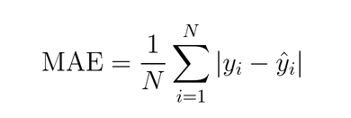
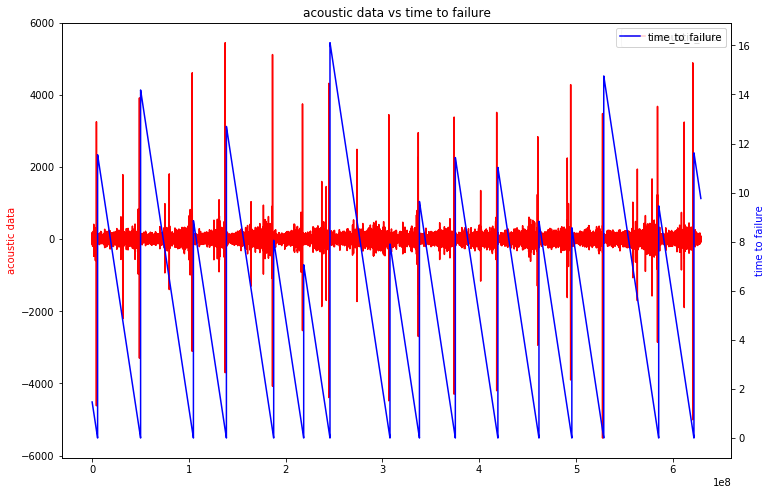

## Table of Contents:

**1. Introduction**

**2. Data Overview**

**3. Data Preprocessing**

**4. Feature Extraction**

**5. Machine Learning Models**

**6. Feature Selection**

**7. Results**

## Introduction

Predicting the time remaining before laboratory earthquakes occur from real-time seismic data.

### Description
Forecasting earthquakes is one of the most important problems in Earth science because of their
devastating consequences. Current scientific studies related to earthquake forecasting focus on
three key points: when the event will occur, where it will occur, and how large it will be.

The goal of the challenge is to capture the physical state of the laboratory fault and how close
it is from failure from a snapshot of the seismic data it is emitting. We will have to build a model
that predicts the time remaining before failure from a chunk of seismic data.

### Problem Statement:
To predict the time remaining before laboratory earthquakes occur from real-time seismic data.
Sources:
<br>
[Kaggle](https://www.kaggle.com/c/LANL-Earthquake-Prediction)
<br>
[Kaggle Discussion](https://www.kaggle.com/c/LANL-Earthquake-Prediction/discussion)

### Data
train.csv - A single, continuous training segment of experimental data.

### Data Overview
train.csv contains 2 columns: 
- acoustic_data - the seismic signal [int16] 
- time_to_failure - the time (in seconds) until the next laboratory earthquake [float64]
- Number of rows in Train.csv = 629145480

<p align="center">
  
</p>

### Type of Machine Learning Problem
It is a Regression problem, for a given chunk of seismic data we need to predict the time remaining
before laboratory earthquakes occur

### Performance Metric 

Source: https://www.kaggle.com/c/LANL-Earthquake-Prediction#evaluation 
<br>
Metric(s): Mean Absolute Error

It is the average absolute difference between the actual and predicted values.

<p align="center">
  
</p>

## Approach
1. EDA/Preprocessing: Since the test data has 150000 samples in each segment, we convert the train data into samples of size 150000 and hence we get 4194 samples.Since the datasize is too small, We split the 6.2m train data into 6 slices, take 4000 random samples,each of size 150000 from each slice. Hence now we have 24000 training data. 
It takes huge time to run therefore we use multiprocessing. We divide the raw data into 6 slices using the following function. We save each of the 6 slices of raw data into csv files for furthur processing. We join the 6 slices into one train data which now has 24000 datapoints along with coressponding 24000 output.

2. Feature Engineering: We use many statistical features like mean, kurtosis and signal processing features like, entropy, fft.

3. Machine Learning Models: We use Lgbm and xgboost and compare them and tune the hyperparameters to get the better results.
We use MAE as the metric


I have used several kernels from kaggle and ideas from discussion threads . 

[vettejeep kernel](https://www.kaggle.com/vettejeep/masters-final-project-model-lb-1-392)
<br>
[allunia kernel](https://www.kaggle.com/allunia/shaking-earth)
<br>
[gpreda kernel](https://www.kaggle.com/gpreda/lanl-earthquake-eda-and-prediction)

## Exploratory Data Analysis
1. It is given that the earthquake occurs when the time_to_failure hits 0, hence we can count that there are 16 occurences of earthquake in the whole training data

<p align="center">
  
</p>

2. If we zoom into the data we can see that the acoustic data has a peak just before the earthquake occurs and the whole training data follows the same pattern..

<p align="center">
  
</p>

3. If we plot the data for 1000000 points we can see that the graph is continously decreasing but if we zoom into it we can see that the time_to_failure stops decreasing for a while when it reaches ~4000 samples.
It is due to the fact that the data is recorded in bins of 4096 samples and the recording device stops for 12 microseconds after each bin.

<p align="center">
  
</p>

## Data Preprocessing

Since the test data has 150000 samples in each segment, we convert the train data into samples of size 150000 and hence we get 4194 samples.
<br>
Since the datasize is too small, We split the 6.2m train data into 6 slices, take 4000 random samples,each of size 150000 from each slice. Hence now we have 24000 training data. 
It takes huge time to run therefore we use multiprocessing.

We divide the raw data into 6 slices using the following function. We save each of the 6 slices of raw data into csv files for furthur processing.
```
def split_raw_data():
```

We then create 4000 random indices for each slice using random sampling. Also we save the indices into a file.
```
def build_rnd_idxs(): 
```

The below function creates features for each of the 4000 datapoints in each slice. proc id is the process id. It might take a day even with multiprocessing.
```
def build_fields(proc_id)
```

We now use python pool for multiprocessing. The run_mp_build uses 6 workers to create features parallelly.
```
def run_mp_build():
 ```
    
We join the 6 slices into one train data which now has 24000 datapoints along with coressponding 24000 output.
```
def join_mp_build():
```

We scale the features using standardisation.
```
def scale_fields():
```


## Feature Extraction

1> Statistical Features:

* Mean
* Median
* Kurtosis
* Skew: skewness of the frequency domain signal
* Moving Averages
* Exponential Moving Averages
* Quantiles
* Rolling features: we calculate statistical values like mean for different windows.
* Trend: gives the slope of the signal

2> Signal Processing features:

* Low Pass Filters: Removes the high frequency components
* High Pass Filters: Removes low frequency components
* Band Pass Filters: allows signals between two specific frequencies to pass.
* FFT: we use fourier frequencies.
* Peaks: Returns the number of values above threshold
* hjorth parameters: Returns the activity, mobility and complexity of the signal.
* Entropy: signal entropy. 


## Machine Learning Models

### LGBM

We use the default and approximate values for parameters since we came to know that cv is not reliable.
Light GBM, to its advantage, can handle the large size of data and takes lower memory to run. Training speed is much faster than other ensemble models and can also be interpretable. we get a score of 1.340. We can see below how well the model is predicting.

<p align="center">
  
</p>

### XGBOOST
Since we want to maximize the score, xgboost has demonstrated successful for kaggle competitions. We were able to reach a mae of 1.314. We can see below that the model is not overfitting to train data and is generalising well.

<p align="center">
  
</p>

### Stacking
Stacking models are very powerful and since interpretability is not important, we stack lgbm and xgboost model and use Linear Regression as meta regressor. We find that the mae is 1.379

## Feature Selection
SKlearn selectkbest: selectkbest selects top features and gives us the feature scores. we use top 300 features and apply LGBM and compare the results. We also tried out autoencoders, pearson correlation to reduce the dimensions but the performance dropped.
We can see that rolling features and peaks are the most important features.

<p>
  
</p>

## Results
XGB gives the highest score of 1.314 which is currently at the 27th position at the kaggle public leaderboard.

<p align="center">
  
</p>


At the time of submission, the score was at top 1% of kaggle public leaderboard. As it is public lb the leaderboard positions might change.

<p align="center">

</p>

## Conclusion:
<br>
1. We do EDA and find some insights from the data.
<br>
2. Since the test data has 150000 samples in each segment, we convert the train data into samples of size 150000 and hence we get 4194 samples.
<br>
3. Since the datasize is too small, We split the 6.2m train data into 6 slices, take 4000 random samples,each of size 150000 from each slice. Hence now we have 24000 training data. 
It takes huge time to run therefore we use multiprocessing.
<br>
4.We divide the raw data into 6 slices using the following function. We save each of the 6 slices of raw data into csv files for furthur processing. We join the 6 slices into one train data which now has 24000 datapoints along with coressponding 24000 output.
<br>
5. We then use many statistical features like mean, kurtosis and signal processing features like, entropy, fft.
<br>
6. We then apply Lgbm and xgboost and compare them and tune the hyperparameters to get the better results.
We use MAE as the metric. We can see that we get the best results as 1.34 with lgbm model.
<br>

## Future Work
 
 1. We could use newer and powerful models like Catboost.
 2. Use KS Test, PCA as feature selection technique.

## References

[vettejeep kernel](https://www.kaggle.com/vettejeep/masters-final-project-model-lb-1-392)
<br>
[allunia kernel](https://www.kaggle.com/allunia/shaking-earth)
<br>
[gpreda kernel](https://www.kaggle.com/gpreda/lanl-earthquake-eda-and-prediction)
<br>
[kaggle discussion](https://www.kaggle.com/c/LANL-Earthquake-Prediction/discussion)
<br>
[kaggle kernels](https://www.kaggle.com/c/LANL-Earthquake-Prediction/kernels)
<br>
[Siraj Raval Youtube](https://www.youtube.com/watch?v=TffGdSsWKlA)

